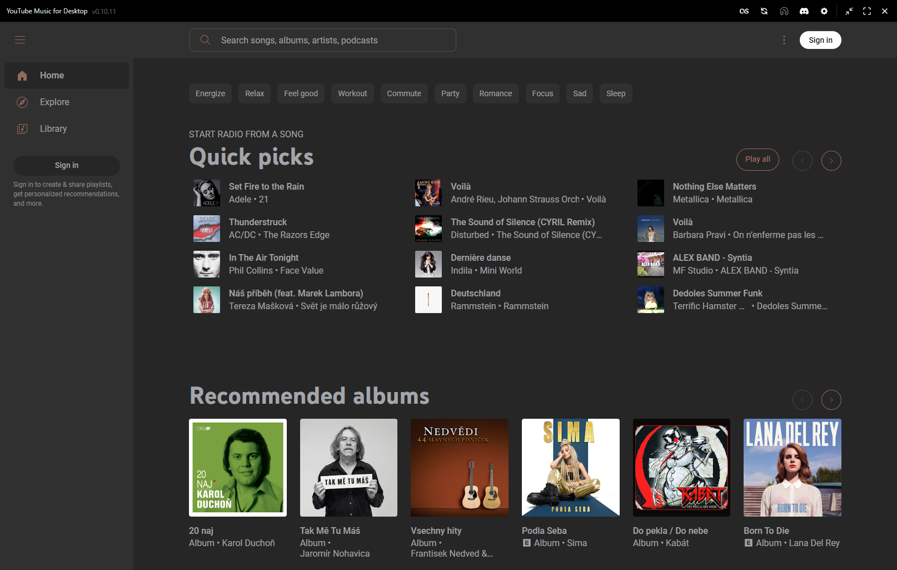
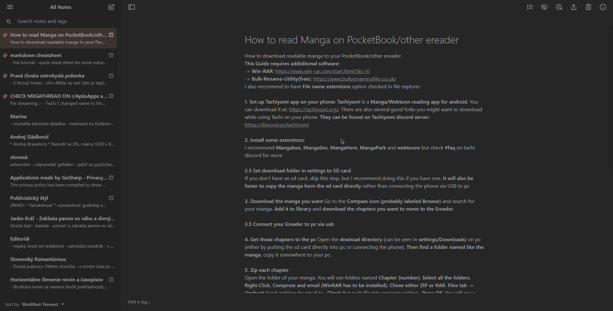

# CSS Themes
Collection of rosebox (user)css themes for different websites.   
Use Stylus (for example) to apply them. Stylus: [chrome](https://chrome.google.com/webstore/detail/stylus/clngdbkpkpeebahjckkjfobafhncgmne?hl=sk), [firefox](https://addons.mozilla.org/en-US/firefox/addon/styl-us/?utm_source=addons.mozilla.org&utm_medium=referral&utm_content=search)

Currently available themes:
### ytmdesktop2
``ytmdesktop.scss``  
link: [ytmdesktop2 github repo](https://github.com/Venipa/ytmdesktop2)  
author: [xohorses](https://xohorses.glitch.me), [xohorses kofi page](https://ko-fi.com/xohorses)  
  
  
### Simplenote
``simplenote.user.css``    
use with light theme since dark theme is wierd at the moment  
> this theme might be broken, as i no longer use simplenote. 
> if you find some bugs, feel free to report them or better yet, open a PR.
  
  

### Redlib
[Redlib](https://github.com/redlib-org/redlib) supports rosebox out of the box since 2021. [relevant PR](https://github.com/libreddit/libreddit/pull/237)
