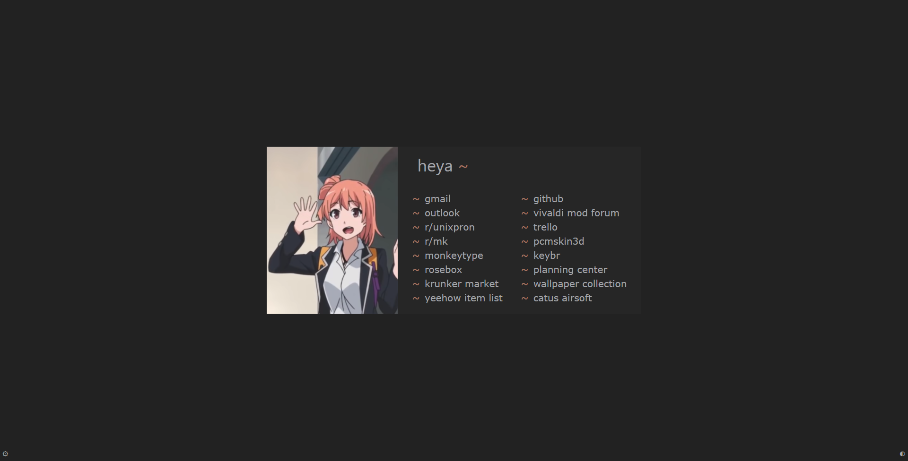
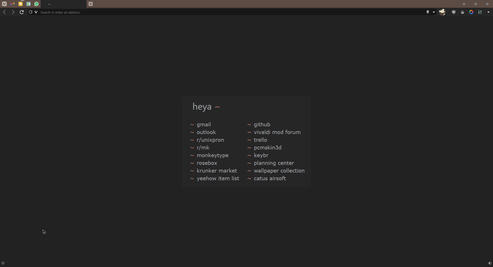
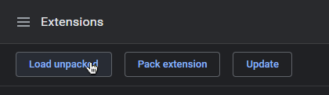

# HEADS UP! new startpage is done!  
this is my old startpage, however i have completely rewritten it to be modular. you can find it [here](https://github.com/KraXen72/glide).  
this part of the rosebox repo (minimal-startpage) will no longer be updated.
[https://github.com/KraXen72/glide](https://github.com/KraXen72/glide)
    
# heya ~  
this is my minimal rosebox-themed startpage made with HTML, CSS, W3.CSS and JS.  

- click **bottom right &#9680;** to toggle the visibility of the image
- click **bottom left &#9881;** to open the settings popup 
- you can make these buttons **invisible but clickable** in the settings.
  

## intuitive settings / config ui + saving config to localStorage.

  
## installation (chrome / chromium)  
I included a simple ``manifest.json`` so you can import it as a chrome extension.  
just clone this repo and load unpacked extension. (you have to enable developer mode)  

you can also install this in firefox or any browser, just set the ``index.html`` to your new tab page / create an addon which replaces the new tab page with this ``index.html``

or just use this [link](https://kraxen72.github.io/rosebox/minimal-startpage) idc 

## custom image
if you want a custom image, put it in the ``rosebox/minimal-startpage/img`` folder.   
it is recommended for the image to have an aspect ratio of 0.75 to 0.85 to fit correctly. (aspect ratio = width / height). alternatively, if you don't want to edit the image, you can uncomment the last few lines in ``main.css`` and play around with it until satisfied:
- ``object-fit:`` can be ``cover`` which selects a portion of the image to fit the space or ``contain`` which resizes the whole image to fit  
- ``object-position:`` determines where the image will be aligned. some basic ones are ``top``, ``center`` and ``bottom``. check [this link](https://css-tricks.com/almanac/properties/o/object-position/#examples) for more complex alignments.
