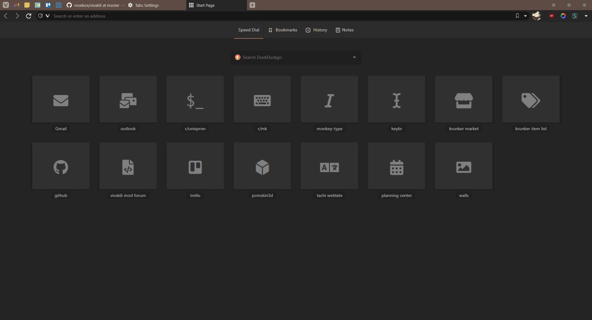
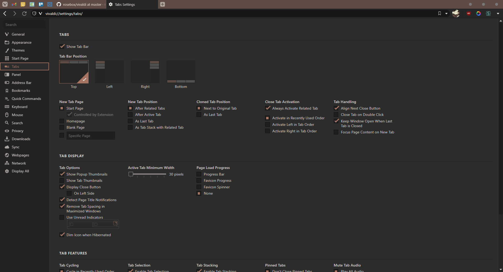
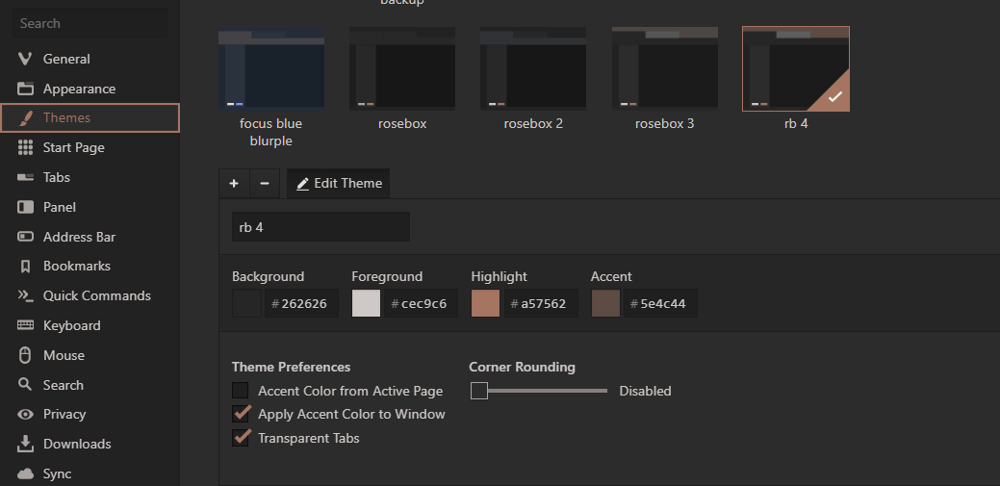
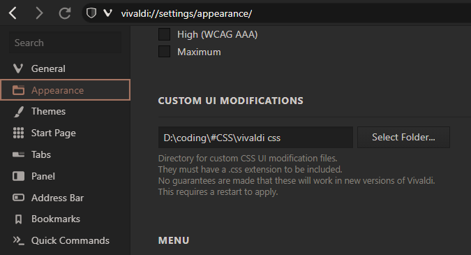

# rosebox theme for vivaldi

  
this theme consists of 2 main parts:  
  
## Vivaldi theme: 
Create a new theme and set it up like this:  
> **vivaldi 5.0 and up: [apply from vivaldi theme store](https://themes.vivaldi.net/themes/g1OJ53DlAob)** 
   
  

## Custom css
go to ``vivaldi://experiments``  
enable  
  
this will show up in your settings(set your own directory):  
   
and put the custom.css file from this repo there  
